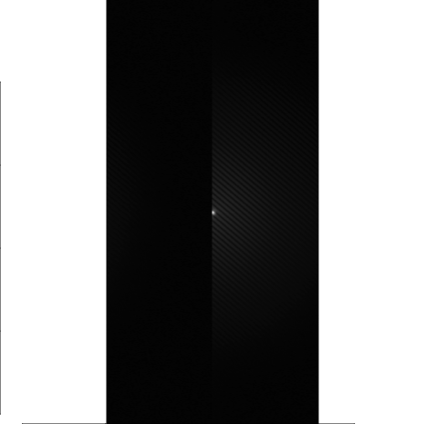

```{r setup, include = FALSE}
knitr::opts_chunk$set(
  collapse = TRUE,
  comment = "#>"
)
```

## Workflow for reduction of speckle interferometric binary stars

Calculate statistics for object file
```{r eval = FALSE}
obj_filename <- file.choose() # Choose file with binary star
obj_stat <- speckle_stat(obj_filename)
```

Calculate statistics for dark file
```{r eval = FALSE}
dark_filename <- file.choose() # Choose file with dark frames
dark_stat <- speckle_stat(dark_filename)
```

Calculate average dark frame
```{r eval = FALSE}
mid_dark <- middle_frame(filename = dark_filename, stat = dark_stat)
```

Calculate average flat field frame with average dark subtraction
```{r eval = FALSE}
mid_flat <- middle_frame(filename = file.choose() , dark = mid_dark) # Choose file with flat fields
```

Calculate power spectrum with subtraction of neighboring frame
```{r eval = FALSE}
ps_diff <- ps(obj_filename, dark = NULL, flat = NULL, diff = 1)
```

Calculate acf
```{r eval = FALSE}
acf <- speckle_acf(ps_diff)
```

Calculate power spectrum
```{r eval = FALSE}
ps <- ps(obj_filename, dark = mid_dark, flat = mid_flat, diff = 0) # include stats
```



